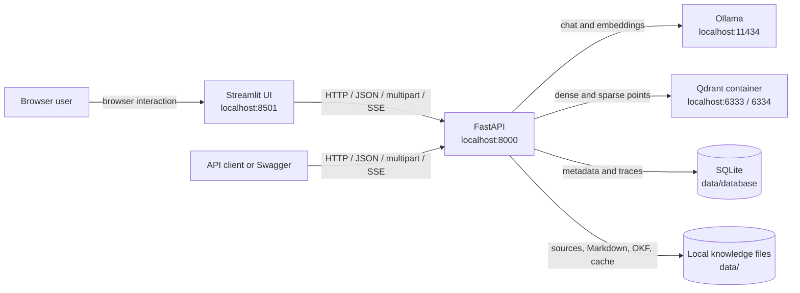
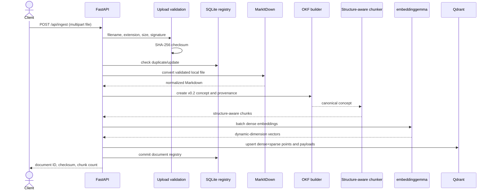
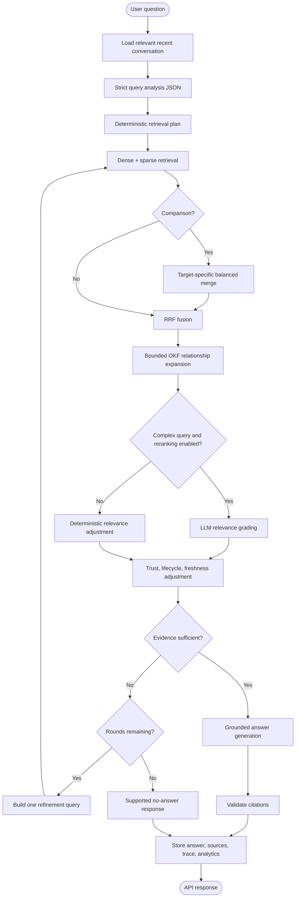

# AUSM Smart RAG: Architecture and Complete Setup Guide

This document explains how AUSM Smart RAG is designed, why its components exist, how data moves
through the system, and how to run the complete workflow on a new computer: clone the repository,
install dependencies, start services, upload a document, ask a question, and inspect the result.

For a shorter project overview and command reference, see [README.md](README.md).

## 1. What the system does

AUSM Smart RAG is a local-first retrieval-augmented generation system. It does more than perform a
single vector search. Before retrieval it analyzes the question, resolves relevant conversation
context, classifies the request, detects comparisons, extracts entities, and decides whether the
question needs decomposition. It then combines semantic and lexical retrieval, expands useful OKF
relationships, reranks when appropriate, checks whether the evidence is sufficient, and either
answers with citations or refuses to invent unsupported information.

The normal runtime uses only local services:

- Streamlit for the browser-based user interface;
- FastAPI for the HTTP API;
- Ollama with `gemma4:e4b` for query analysis and answer generation;
- Ollama with `embeddinggemma` for dense embeddings;
- MarkItDown for document conversion;
- Open Knowledge Format v0.2 as the canonical knowledge representation;
- Qdrant for dense and sparse retrieval indexes;
- SQLite for documents, conversations, traces, and analytics.

No hosted LLM, embedding, reranking, or vector database is required.

## 2. Deployment architecture

The initial deployment intentionally runs only Qdrant in Docker. FastAPI and Ollama run directly on
the host so Ollama can use the host's available CPU/GPU configuration without extra container setup.



Default addresses:

| Component | Address | Purpose |
| --- | --- | --- |
| Streamlit | `http://localhost:8501` | Complete browser workspace |
| FastAPI | `http://localhost:8000` | Ingestion, query, trace, and analytics API |
| API documentation | `http://localhost:8000/docs` | Interactive OpenAPI interface |
| Ollama | `http://localhost:11434` | Local chat and embedding models |
| Qdrant REST | `http://localhost:6333` | Vector collection and dashboard |
| Qdrant gRPC | `localhost:6334` | Qdrant gRPC endpoint |
| Qdrant dashboard | `http://localhost:6333/dashboard` | Collection inspection |
| SQLite | `data/database/smart_rag.db` | Application and analytics database |

If FastAPI is containerized in the future, use
`OLLAMA_BASE_URL=http://host.docker.internal:11434` on Windows. The current Compose file does not
containerize FastAPI or Ollama.

## 3. Architectural principles

### 3.1 OKF is canonical; Qdrant is derived

The source of truth follows this order:

```text
Original document -> normalized Markdown -> OKF v0.2 -> Qdrant indexes
```

Qdrant is not the knowledge base. It is a search acceleration layer. If its volume is lost, the
collection can be rebuilt from OKF:

```powershell
.\.venv\Scripts\python.exe -m app.cli rebuild-index
```

### 3.2 Generation and embeddings use separate models

`gemma4:e4b` handles language reasoning and generation. `embeddinggemma` maps text to dense vectors.
The application detects the embedding dimension at runtime before creating a Qdrant collection; no
dimension is hard-coded.

### 3.3 Retrieval is hybrid

Dense retrieval is good at semantic paraphrases. Sparse retrieval is good at exact names, error
codes, identifiers, and specialized vocabulary. Its word features are supplemented with down-weighted
five-character features over text with spacing and punctuation removed. This lets a normal query
match PDF output such as `whichindicateswhetherthemobile...` without making character matches
stronger than healthy word matches. The system independently queries both named Qdrant vectors and
fuses their rankings using reciprocal rank fusion (RRF).

For a document at rank `r`, its contribution is approximately:

```text
1 / (60 + r)
```

Contributions from the dense and sparse rankings are added, then candidates are sorted by the fused
score. Raw dense and sparse scores are retained in the response and trace for diagnosis.

### 3.4 Agentic means adaptive, not unbounded

Simple factual questions take a short route. Comparisons, analytical requests, synthesis, and
multi-hop questions may use target-specific searches, decomposition, LLM reranking, and one refined
retrieval pass. `MAX_RETRIEVAL_ROUNDS` bounds the loop; the default is two.

## 4. Source code organization

```text
frontend/
  app.py                  Streamlit workspace and page rendering
  api_client.py           typed FastAPI client and SSE parser
  styles.py               visual theme helpers

app/
  main.py                 FastAPI application and lifespan
  config.py               validated environment configuration
  container.py            dependency wiring
  logging.py              structured JSON logging

  api/
    health.py             component health checks
    ingest.py             upload and reindex endpoints
    documents.py          document listing and deletion
    query.py              query, streaming, history, and trace endpoints
    analytics.py          question/comparison analytics and statistics

  ingestion/
    security.py           filename, size, signature, and type checks
    markitdown_converter.py local document conversion
    okf_builder.py        conformant OKF v0.2 output and provenance
    chunker.py            structure-aware Markdown chunking
    pipeline.py           duplicate, update, ingest, delete, and rebuild lifecycle

  knowledge/
    okf.py                OKF parser and concept discovery
    graph.py              Markdown-link and concept relationship graph

  llm/
    ollama_client.py      central retrying chat, structured chat, embedding client
    schemas.py            strict query/retrieval/sufficiency schemas
    prompts.py            protected system prompts

  retrieval/
    index.py              Qdrant collection creation and indexing
    sparse.py             deterministic local lexical vectors
    hybrid.py             dense+sparse searches and RRF
    filters.py            metadata filter construction
    relationship_expander.py OKF graph expansion
    reranker.py           adaptive deterministic/LLM reranking

  agents/
    query_analyzer.py     context resolution and query classification
    planner.py            deterministic retrieval plan
    evidence_checker.py   answerability and missing-aspect checks
    answer_generator.py   grounded generation and citation validation

  rag/
    state.py              explicit Pydantic workflow state
    orchestrator.py       bounded Smart RAG state machine

  database/
    models.py             SQLAlchemy schema
    session.py            engine initialization and SQLite safeguards
    repository.py         persistence and analytics operations
```

`container.py` builds services from explicit dependencies. Request handlers obtain a database
session per request, while the application lifespan owns shared Ollama and Qdrant clients. This
avoids scattering global HTTP clients and model configuration across modules.

The Streamlit process is intentionally a client rather than a second implementation of the RAG
pipeline. It calls FastAPI for every upload, query, delete, health, reindex, trace, and analytics
operation. It never writes directly to OKF, Qdrant, or SQLite, so API lifecycle rules remain the
single source of operational behavior.

## 5. Ingestion architecture

Supported document types:

- PDF (`.pdf`)
- DOCX (`.docx`)
- PPTX (`.pptx`)
- XLSX (`.xlsx`)
- HTML (`.html`, `.htm`)
- text (`.txt`)
- Markdown (`.md`)



### 5.1 Validation and safety

The upload boundary enforces:

- configurable maximum upload size;
- an explicit allowed-extension list;
- basename-only filenames to prevent path traversal;
- safe generated storage directories based on document IDs;
- PDF and Office Open XML signature checks;
- basic binary-content rejection for text-like extensions;
- SHA-256 duplicate detection.

Uploaded documents are data. Their contents are never executed.

### 5.2 Conversion and persistence

The original accepted source is written below `data/sources/<document-id>/`. MarkItDown output is
preserved independently below `data/markdown/`. Conversion is not coupled directly to Qdrant.

### 5.3 OKF generation

Each source creates an OKF concept below `data/okf/documents/` with:

- a required non-empty `type`;
- title, description, and tags;
- `status: draft` for automatically generated content;
- a `generated` actor and timestamp;
- a source resource with the original document ID and filename;
- document ID and SHA-256 extension fields.

The system does not invent `verified` or `stale_after`. Raw Markdown reference files use a neutral
`.source` suffix under `references/` so OKF consumers do not mistake them for concept documents.

### 5.4 Structure-aware chunking

The chunker respects Markdown headings, paragraphs, lists, fenced code, and tables. Code fences and
small tables remain atomic. Chunks target `CHUNK_TARGET_TOKENS` with a configurable block-level
overlap. Each chunk preserves its heading path, parent, concept, document, source hash, trust tier,
lifecycle fields, and source type.

### 5.5 Qdrant collection

The collection contains named vectors:

```text
dense   -> embeddinggemma cosine vector
sparse  -> local hashed term-frequency vector with Qdrant IDF
```

Payload indexes are created for the fields used frequently in filters:

- `document_id`
- `concept_id`
- `okf_type`
- `tags`
- `status`
- `source_sha256`
- `parent_id`

## 6. Query architecture



### 6.1 Query analysis

The LLM returns a strict `QueryPlan` containing:

- original and standalone query;
- query type;
- entities and exact terms;
- comparison targets and dimensions;
- document filters and temporal constraints;
- subquestions;
- whether decomposition and conversation context are required;
- retrieval strategy.

Supported types include factual, locator (section/chapter/page lookup), definition, how-to,
comparison, summarization, multi-hop, analytical, synthesis, document-specific, follow-up,
exploratory, and no-retrieval. Locator queries preserve the requested heading as an exact term and
also match words that PDF extraction has incorrectly joined together.

Malformed JSON is retried once with the schema. If validation still fails, deterministic Python
classification provides a safe fallback. Query analysis is content-address cached, but final answers
are not blindly cached.

### 6.2 Conversation resolution

Recent conversation messages and retrieval queries are separate concepts. The analyzer sees a
bounded recent history and rewrites only when context is required. For example:

```text
Earlier: Tell me about Qdrant.
Current: How does it compare with Chroma?
Standalone retrieval query: Compare Qdrant with Chroma.
```

### 6.3 Comparison-aware retrieval

For `A vs B`, the system does not retrieve only the combined string. It builds searches for A, B,
and the full comparison, then merges results with cross-query boosts and deduplication. This keeps
evidence balanced when one target has more documentation.

### 6.4 Relationship expansion

Markdown links between OKF concepts form a lightweight graph. Strong initial results can add directly
linked or sibling concepts. `MAX_GRAPH_HOPS` limits expansion and prevents context flooding.

### 6.5 Reranking, trust, and freshness

Simple questions use the fused ranking plus deterministic relevance adjustment. Complex questions
may send only the small fused set to `gemma4:e4b` for relevance grading.

For simple questions, reranking measures ordinary token overlap and spacing-independent compact
phrase coverage. A complete compact match receives an explicit directness preference, so a passage
that nearly quotes the question outranks broader passages that merely share common words.

Internal ranking also applies bounded adjustments:

- human-reviewed over machine-confirmed over unverified;
- stable concepts receive a small preference;
- deprecated and stale concepts are down-ranked.

Trust never completely overrides relevance, and internal scores are never written back as fake OKF
trust metadata.

### 6.6 Evidence sufficiency and no-answer behavior

The checker combines channel scores, lexical coverage, retrieved evidence, requested targets, and
LLM assessment for complex questions. Comparisons require evidence for each target. If information is
missing and a retrieval round remains, the system performs one refined search. Otherwise it returns:

```text
I don't have enough supported information in the indexed knowledge base to answer that.
```

### 6.7 Grounded generation and prompt-injection protection

Generation receives the original question, standalone question, query type, comparison metadata,
numbered evidence, source filename, heading, trust, status, and staleness. System prompts explicitly
treat retrieved text as untrusted reference material, not instructions. The application never sends
document content to arbitrary tools.

Simple factual and definition questions send at most the first four query-centered excerpts to the
generator. This reduces context drift and recency bias from long, unrelated chunks. A fragment that
begins with `which`, `that`, or `who` takes a deterministic path when the matching clause is present:
the system extracts the immediately preceding subject and cites that exact passage. For example,
`which indicates whether the mobile supports IPv4, IPv6 or both` resolves to `PDN type`.

Ollama thinking output is disabled for structured operations and user-visible answers. Only final
answer content is accepted. Empty generations are retried once and then returned as a clear service
error instead of a blank answer.

Citation validation normalizes markers, removes references outside the supplied evidence set, and
returns the exact source chunks separately in the API response.

## 7. SQLite data model and observability

SQLite stores operational metadata, not embedding vectors.

| Table | Purpose |
| --- | --- |
| `sessions` | Conversation identity and timestamps |
| `messages` | User and assistant conversation messages |
| `documents` | Source registry, paths, checksum, state, and chunk count |
| `queries` | Original/standalone question, type, entities, confidence, latency |
| `query_plans` | Structured query analysis and retrieval plan |
| `retrieval_runs` | Every subquery and retrieval round with candidate counts |
| `retrieval_results` | Ranked chunks, scores, documents, and retrieval channels |
| `answer_sources` | Citation-to-document/chunk provenance |
| `comparison_edges` | Canonical unordered entity pairs and counts |
| `user_feedback` | Feedback-ready rating and comment records |

SQLite uses foreign keys and WAL mode. Every completed query stores a trace accessible at
`GET /api/trace/{query_id}`. Structured logs contain operation IDs, duration, result counts, and
errors without logging full document bodies.

## 8. Complete setup and first-result walkthrough

The following Windows workflow starts with no project checkout and ends with a cited answer.

### Step 1: install software

Install Git, Python 3.12, Docker Desktop, and Ollama. Optional PowerShell commands:

```powershell
winget install --id Git.Git -e
winget install --id Python.Python.3.12 -e
winget install --id Docker.DockerDesktop -e
winget install --id Ollama.Ollama -e
```

Restart PowerShell afterward. Open Docker Desktop and wait for its engine to start. Start Ollama.

Confirm the basics:

```powershell
git --version
py -3.12 --version
docker info
ollama list
```

If `docker` is not found immediately after installation, open a new terminal. For the current
terminal only, this fallback is also safe:

```powershell
$env:Path += ';C:\Program Files\Docker\Docker\resources\bin'
```

### Step 2: clone the project

```powershell
git clone https://github.com/deb-cod/ausm-rag.git
cd ausm-rag
```

### Step 3: run the automated setup

```powershell
powershell -ExecutionPolicy Bypass -File .\scripts\setup.ps1
```

The setup performs these operations:

1. Verifies Python 3.12.
2. Creates `.venv` if it does not exist.
3. Installs the project and developer dependencies.
4. Runs `pip check`.
5. Copies `.env.example` to `.env` only when `.env` is absent.
6. Locates Ollama even when a new terminal has not inherited its PATH.
7. Downloads `gemma4:e4b` and `embeddinggemma` only when missing.
8. Locates Docker Desktop even when `docker` is absent from PATH.
9. Starts Qdrant with Docker Compose.
10. Waits up to 60 seconds for Qdrant's health endpoint.

Rerunning setup is safe. Existing `.env` values are preserved.

### Step 4: run the installation doctor

```powershell
powershell -ExecutionPolicy Bypass -File .\scripts\doctor.ps1 -RunTests
```

Expected checks:

```text
[OK] .venv
[OK] Python imports
[OK] Streamlit UI
[OK] Python packages
[OK] Ollama
[OK] gemma4:e4b
[OK] embeddinggemma
[OK] Docker engine
[OK] Qdrant
[OK] Ruff
[OK] Pytest
```

### Step 5: start the API

In terminal 1:

```powershell
.\.venv\Scripts\python.exe -m uvicorn app.main:app --reload
```

Wait for:

```text
Application startup complete.
Uvicorn running on http://127.0.0.1:8000
```

### Step 6: verify complete health

In terminal 2, from the repository directory:

```powershell
$health = Invoke-RestMethod http://127.0.0.1:8000/health
$health | ConvertTo-Json -Depth 6
```

Expected top-level result:

```json
{
  "status": "ok",
  "components": {
    "api": {"status": "ok"},
    "sqlite": {"status": "ok"},
    "qdrant": {"status": "ok"},
    "ollama": {"status": "ok"},
    "llm_model": {"status": "ok", "model": "gemma4:e4b"},
    "embedding_model": {"status": "ok", "model": "embeddinggemma"}
  }
}
```

If the status is `degraded`, inspect the component whose status is not `ok` before ingesting.

### Step 7: start the Streamlit UI

Keep FastAPI running in terminal 1. In terminal 2:

```powershell
.\.venv\Scripts\python.exe -m streamlit run frontend/app.py `
  --server.address 127.0.0.1 `
  --server.port 8501
```

Open `http://127.0.0.1:8501`. The UI includes Ask, Library, Operations, Insights, and Diagnostics
workspaces. The remaining command-line examples are still useful for automation and API diagnosis.

### Step 8: upload a document

Choose a supported document. The example below uses a PDF:

```powershell
$DocumentPath = 'C:\docs\employee-handbook.pdf'
$UploadJson = curl.exe -sS -X POST `
  -F "file=@$DocumentPath;type=application/pdf" `
  http://127.0.0.1:8000/api/ingest
$Upload = $UploadJson | ConvertFrom-Json
$DocumentId = $Upload.document_id
$Upload | ConvertTo-Json -Depth 5
```

`curl.exe` works with Windows PowerShell 5.1 and PowerShell 7. A successful response resembles:

```json
{
  "document_id": "bdca2181-7318-42c0-9d4f-af652824d2ad",
  "filename": "employee-handbook.pdf",
  "sha256": "...",
  "chunks": 14,
  "duplicate": false,
  "updated_document_id": null,
  "status": "ready"
}
```

The response is printed and its `document_id` is saved in `$DocumentId` for the later trace and
delete examples. If the same file was already uploaded, `duplicate` is `true` and its existing
document ID is returned. List all registered documents:

```powershell
Invoke-RestMethod http://127.0.0.1:8000/api/documents | ConvertTo-Json -Depth 6
```

### Step 9: ask a question and see the answer

```powershell
$QueryBody = @{
    session_id = 'first-demo'
    query = 'What does the employee handbook say about annual leave?'
} | ConvertTo-Json

$Result = Invoke-RestMethod `
    -Method Post `
    -Uri http://127.0.0.1:8000/api/query `
    -ContentType 'application/json' `
    -Body $QueryBody `
    -TimeoutSec 300

$Result | ConvertTo-Json -Depth 10
```

The first query can be slower because Ollama loads the model. A successful response contains:

```json
{
  "query_id": "...",
  "trace_id": "...",
  "session_id": "first-demo",
  "answer": "Employees receive ... [1]",
  "query_type": "factual",
  "standalone_query": "What does the employee handbook say about annual leave?",
  "confidence": 0.82,
  "no_answer": false,
  "retrieval_rounds": 1,
  "sources": [
    {
      "citation": 1,
      "source_file": "employee-handbook.pdf",
      "heading": "Annual Leave",
      "concept_id": "documents/.../...",
      "chunk_id": "...",
      "channels": ["dense", "sparse"]
    }
  ]
}
```

For a compact terminal view:

```powershell
$Result.answer
$Result.sources | Select-Object citation, source_file, heading, score, channels
```

The answer text must cite only entries present in `sources`. If the indexed knowledge does not
support the question, `no_answer` is `true` and the system returns a transparent refusal.

### Step 10: ask a comparison

After uploading two relevant documents:

```powershell
$ComparisonBody = @{
    session_id = 'first-demo'
    query = 'Compare the authentication methods in Product A and Product B for SSO and MFA.'
} | ConvertTo-Json

$Comparison = Invoke-RestMethod `
    -Method Post `
    -Uri http://127.0.0.1:8000/api/query `
    -ContentType 'application/json' `
    -Body $ComparisonBody `
    -TimeoutSec 300

$Comparison.answer
$Comparison.comparison_targets
```

The query type should be `comparison`, and retrieval runs independently for each target plus the
combined comparison.

### Step 11: ask a follow-up

Reuse the session ID so relevant history is available:

```powershell
$FollowUpBody = @{
    session_id = 'first-demo'
    query = 'How is that different when SSO is enabled?'
} | ConvertTo-Json

Invoke-RestMethod `
    -Method Post `
    -Uri http://127.0.0.1:8000/api/query `
    -ContentType 'application/json' `
    -Body $FollowUpBody `
    -TimeoutSec 300 | ConvertTo-Json -Depth 10
```

### Step 12: inspect the retrieval trace

```powershell
$QueryId = $Result.query_id
Invoke-RestMethod "http://127.0.0.1:8000/api/trace/$QueryId" |
    ConvertTo-Json -Depth 12
```

The trace shows query type, standalone query, structured plan, subqueries, retrieval rounds, dense
and sparse candidate counts, fused counts, and retrieval latency.

Other inspection endpoints:

```powershell
Invoke-RestMethod http://127.0.0.1:8000/api/queries | ConvertTo-Json -Depth 8
Invoke-RestMethod http://127.0.0.1:8000/api/analytics/questions | ConvertTo-Json -Depth 8
Invoke-RestMethod http://127.0.0.1:8000/api/analytics/comparisons | ConvertTo-Json -Depth 8
Invoke-RestMethod http://127.0.0.1:8000/api/stats | ConvertTo-Json -Depth 8
```

### Step 13: delete a document when finished

```powershell
Invoke-RestMethod `
    -Method Delete `
    -Uri "http://127.0.0.1:8000/api/documents/$DocumentId"
```

Deletion removes the registry entry, source file, normalized Markdown, document-specific OKF
artifacts, and Qdrant points.

## 9. API endpoint reference

| Method | Endpoint | Purpose |
| --- | --- | --- |
| GET | `/health` | Check API, SQLite, Qdrant, Ollama, and both models |
| POST | `/api/ingest` | Validate, convert, canonicalize, chunk, and index a file |
| GET | `/api/documents` | List registered documents |
| DELETE | `/api/documents/{document_id}` | Delete a document and derived artifacts |
| POST | `/api/query` | Run the complete Smart RAG workflow |
| POST | `/api/query/stream` | Return operational and answer events over SSE |
| POST | `/api/reindex` | Recreate Qdrant from OKF through the API |
| GET | `/api/queries` | List recent structured queries |
| GET | `/api/queries/{query_id}` | Inspect one query and its sources |
| GET | `/api/trace/{query_id}` | Inspect its query plan and retrieval runs |
| GET | `/api/analytics/questions` | Common questions, types, and low-confidence queries |
| GET | `/api/analytics/comparisons` | Canonical entity-pair comparison counts |
| GET | `/api/stats` | Document, chunk, query, latency, and no-answer statistics |

## 10. Configuration

Setup creates `.env` from `.env.example`. Important variables:

```dotenv
OLLAMA_BASE_URL=http://localhost:11434
OLLAMA_LLM_MODEL=gemma4:e4b
OLLAMA_EMBEDDING_MODEL=embeddinggemma
QDRANT_URL=http://localhost:6333
QDRANT_COLLECTION=smart_rag
SQLITE_URL=sqlite:///data/database/smart_rag.db

CHUNK_TARGET_TOKENS=700
CHUNK_OVERLAP_TOKENS=100
DENSE_TOP_K=20
SPARSE_TOP_K=20
FUSED_TOP_K=15
RERANK_TOP_K=8
MAX_RETRIEVAL_ROUNDS=2
MAX_SUBQUERIES=6
MAX_GRAPH_HOPS=1
ENABLE_LLM_RERANK=true
MIN_EVIDENCE_SCORE=0.15
```

After changing the embedding model, rebuild the collection because its dimension may differ:

```powershell
.\.venv\Scripts\python.exe -m app.cli rebuild-index
```

## 11. Operations and recovery

### Start and stop Qdrant

```powershell
docker compose up -d
docker compose ps
docker compose down
```

`docker compose down` preserves the named volume. Do not add `-v` unless deletion of the Qdrant
index is intentional.

### Rebuild the retrieval index

```powershell
.\.venv\Scripts\python.exe -m app.cli rebuild-index
```

This replaces only the configured collection and regenerates it from OKF.

### Run quality checks

```powershell
.\scripts\doctor.ps1 -RunTests
```

Or run commands separately:

```powershell
.\.venv\Scripts\python.exe -m ruff check app frontend tests
.\.venv\Scripts\python.exe -m pytest -q
.\.venv\Scripts\python.exe -m pip check
```

### Back up knowledge and analytics

Back up `data/`, particularly:

- `data/okf/` for canonical knowledge;
- `data/database/` for conversations, traces, documents, and analytics;
- `data/sources/` if original uploads must be retained.

Qdrant can be rebuilt, so its Docker volume is less critical than OKF and SQLite.

## 12. Troubleshooting decision tree

Start with:

```powershell
.\scripts\doctor.ps1
```

Then use the failing component:

| Failure | Checks and fix |
| --- | --- |
| Python or `.venv` | Run `py -3.12 --version` or `python --version`, then rerun `setup.ps1` |
| Docker command missing | Open a new terminal or add Docker's standard bin directory to PATH |
| Docker engine missing | Start Docker Desktop; verify `docker info` |
| Qdrant unhealthy | Run `docker compose ps` and `docker compose logs qdrant` |
| Port 6333/6334 conflict | Stop the other service or change Compose and `QDRANT_URL` consistently |
| Ollama unreachable | Start Ollama; open `http://localhost:11434/api/tags` |
| LLM missing | Run `ollama pull gemma4:e4b` or configure another installed chat model |
| Embedding model missing | Run `ollama pull embeddinggemma` |
| Embedding dimension changed | Run `python -m app.cli rebuild-index` |
| Conversion rejected | Confirm extension, signature, size, encryption, and file integrity |
| Empty answer from model | Check API logs; the client retries once and returns 503 if still empty |
| Unsupported question | Inspect `no_answer`, sources, and `/api/trace/{query_id}` |
| PowerShell script blocked | Use `powershell -ExecutionPolicy Bypass -File ...` |

## 13. Security boundaries

- Only explicitly uploaded local files are converted.
- User filenames cannot control storage paths.
- Upload size, extension, and basic signatures are validated.
- Retrieved document text is untrusted data, never system instructions.
- Documents cannot invoke commands or tools.
- Raw stack traces are not returned by production API responses.
- Logs avoid full document bodies.
- No secrets are committed; `.env` is gitignored.
- Automatically generated OKF concepts remain draft and unverified.

## 14. Expected healthy end state

After setup and one successful ingestion/query cycle:

1. `docker compose ps` shows Qdrant as healthy.
2. `ollama list` contains `gemma4:e4b` and `embeddinggemma`.
3. `/health` returns top-level `status: ok`.
4. `/api/documents` lists the uploaded file with a nonzero chunk count.
5. `/api/query` returns an answer or a supported no-answer response.
6. A supported answer includes citation markers and matching source objects.
7. `/api/trace/{query_id}` shows retrieval activity.
8. `/api/stats` includes the document and query counts.
9. `data/markdown/` contains MarkItDown output.
10. `data/okf/` contains the canonical concept and provenance.
11. Qdrant contains the derived dense and sparse point representations.
