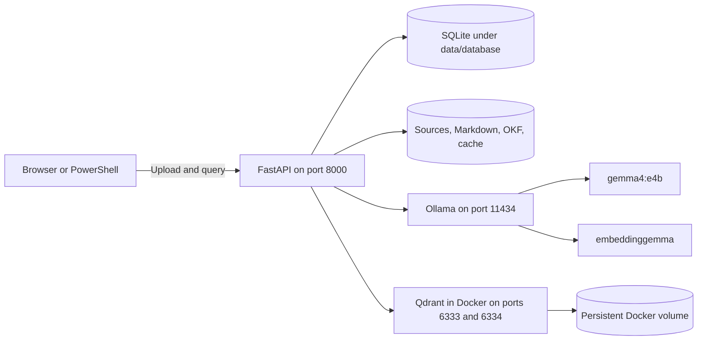
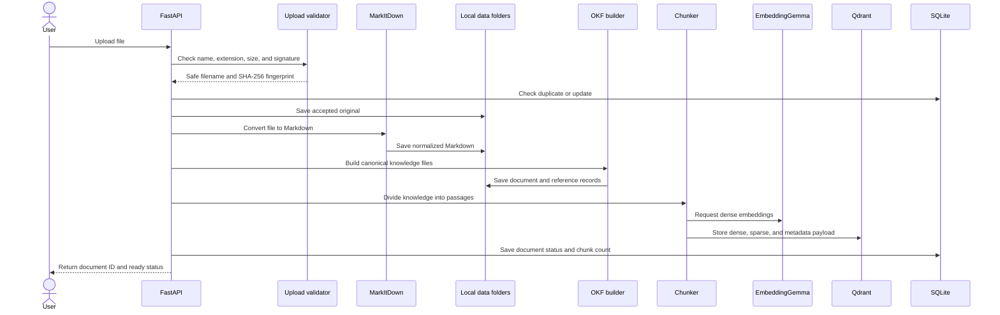
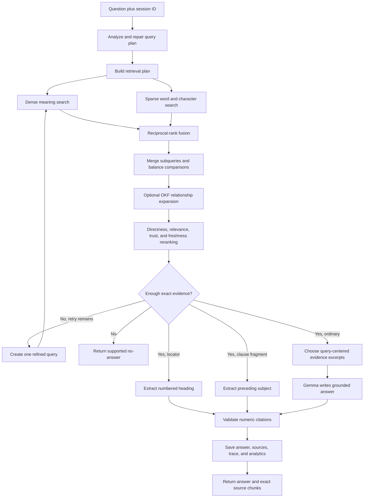
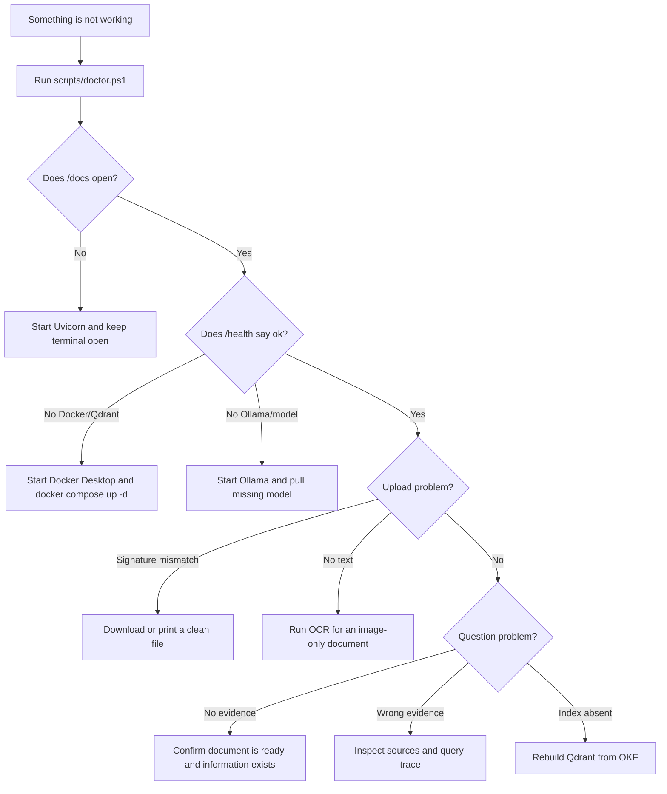

# AUSM Smart RAG: The Super-Detailed Plain-English Handbook

This is the most complete beginner-friendly explanation of the project. It describes what the
application does, why every major part exists, how information moves through the system, how to set
it up on a new computer, how to use it, what is saved, what happens after a restart, how recent
quality fixes work, and how to troubleshoot problems.

You do not need to understand artificial intelligence, Python, Docker, databases, or APIs before
reading this guide. Technical names are included so that you can connect the explanation to the
source code, but each name is explained in ordinary language.

The shorter documents remain useful:

- [README.md](README.md) is the quick developer reference.
- [architecture.md](architecture.md) is the formal technical architecture.
- [explaination.md](explaination.md) is the shorter beginner guide.
- This document is the full plain-language handbook.

## 1. The project in one paragraph

AUSM Smart RAG is a private document question-answering service that runs on your computer. You
upload a PDF, Word document, spreadsheet, presentation, HTML page, text file, or Markdown file. The
application safely reads it, stores an organized master copy, divides it into searchable passages,
and builds two types of local search index. When you ask a question, it searches those passages by
both meaning and wording, checks whether it found enough evidence, and uses a local AI model to
write an answer with numbered sources. For simple questions such as “which section?” or a quoted
sentence fragment, deterministic code can answer directly without asking the AI model to improvise.

## 2. The simplest mental picture

Imagine a private library with one reader:

1. You bring a document to the front desk.
2. A safety clerk checks that the file is what it claims to be.
3. A document reader turns it into consistent, readable text.
4. An archivist stores an organized master copy.
5. A librarian divides the book into index cards.
6. Two catalogues are created: one for meaning and one for exact wording.
7. You ask a question at the front desk.
8. A planner decides how the librarian should search.
9. The librarian searches both catalogues and combines the results.
10. A reviewer checks which passages directly answer the question.
11. If the evidence is good enough, a local writer produces a cited answer.
12. If the evidence is not good enough, the system says so instead of guessing.

The project components map to that library like this:

| Library role | Project component | Plain meaning |
|---|---|---|
| Front desk | FastAPI | Receives uploads and questions over local web addresses |
| Interactive form | Swagger UI | Browser page where you can click buttons to use the API |
| Safety clerk | Upload validator | Checks type, size, filename, and common file signatures |
| Document reader | MarkItDown | Converts supported files into normalized Markdown text |
| Master archive | OKF | Stores inspectable, portable knowledge and source information |
| Index-card maker | Structure-aware chunker | Divides long text into smaller overlapping passages |
| Meaning catalogue | EmbeddingGemma dense vectors | Finds passages with similar meaning |
| Wording catalogue | Local sparse encoder | Finds exact words and spacing-resistant character patterns |
| Fast catalogue cabinet | Qdrant | Stores and searches dense and sparse representations |
| Question planner | Query analyzer and retrieval planner | Decides what kind of search is needed |
| Relevance reviewer | Reranker and evidence checker | Promotes direct evidence and rejects weak evidence |
| Answer writer | Gemma through Ollama | Writes readable answers using retrieved evidence |
| Activity notebook | SQLite | Records documents, sessions, questions, traces, and analytics |
| Prepared service box | Docker | Runs Qdrant consistently on different computers |
| Private Python toolbox | `.venv` | Isolates this project's Python packages from other projects |

## 3. What RAG means

RAG stands for retrieval-augmented generation:

- **Retrieval** means finding relevant passages in your uploaded documents.
- **Augmented** means giving those passages to the answer-writing model as evidence.
- **Generation** means turning the evidence into a readable answer.

Uploading a file does not train or permanently modify the AI model. The model is unchanged. The
application creates a search index so that it can place the right passages in front of the model at
question time.

This difference matters. A normal chatbot may answer from general model memory. This application is
designed to answer from the local knowledge base and expose the passages it used.

## 4. What runs where

The current design is local-first:



In ordinary language:

- FastAPI runs directly on Windows from the project `.venv`.
- Ollama runs directly on Windows and uses local model files.
- Qdrant runs inside Docker Desktop.
- SQLite is one local database file.
- Uploaded and generated files live under the project `data` directory.
- Your browser communicates with FastAPI through `127.0.0.1`, which means this computer.

Default local addresses:

| Service | Address | Purpose |
|---|---|---|
| Interactive API page | `http://127.0.0.1:8000/docs` | Clickable upload and query interface |
| Health report | `http://127.0.0.1:8000/health` | Shows whether every dependency is available |
| FastAPI | `http://127.0.0.1:8000` | Main application server |
| Ollama | `http://127.0.0.1:11434` | Local models |
| Qdrant REST | `http://127.0.0.1:6333` | Search database API |
| Qdrant dashboard | `http://127.0.0.1:6333/dashboard` | Search database browser |
| Qdrant gRPC | `127.0.0.1:6334` | Alternative high-performance protocol |

## 5. The important architectural rule: master knowledge versus search index

The project separates the durable knowledge from the disposable search index.

### The durable side

The original source, normalized Markdown, OKF files, and SQLite records live under `data`. OKF is
treated as the canonical or master knowledge representation.

### The replaceable side

Qdrant is a fast catalogue derived from OKF chunks. If its Docker volume is lost or its vector
format changes, the project can recreate it from OKF:

```powershell
.\.venv\Scripts\python.exe -m app.cli rebuild-index
```

This is why losing the Qdrant index does not automatically mean re-uploading every source file.
Re-uploading is only necessary if both the stored knowledge and your backup are gone.

## 6. Complete upload flow

The upload route is `POST /api/ingest`. The following diagram shows the complete flow.



### 6.1 Reading the upload into memory

FastAPI receives the file as multipart form data. It reads only up to the configured maximum plus
one byte. The extra byte makes it possible to reject an oversized upload without accidentally
accepting a truncated file.

The default maximum is 50 MB and can be changed with `MAX_UPLOAD_MB`.

### 6.2 Safety validation

Before conversion, the application checks:

- the filename is a plain filename and not a path such as `..\secret.txt`;
- the extension is in the allowed list;
- the content is not empty;
- the file is not larger than the configured limit;
- a PDF begins with the expected PDF signature;
- DOCX, PPTX, and XLSX files have the expected ZIP-based signature; and
- text-like files do not begin with obvious binary null bytes.

The file is read as data. It is never executed.

### 6.3 Why a file can have `.pdf` in its name but still be rejected

A filename is only a label. A website can incorrectly save Java data, HTML, or an error page with a
`.pdf` ending. The validator checks the content as well as the name.

One real test file in this project began with Java serialized-object bytes and contained a PDF only
later inside the file. The safe solution was to open it and print it to a new clean PDF rather than
weakening the validator to accept arbitrary wrappers.

### 6.4 Duplicate and update detection

The application calculates a SHA-256 fingerprint from the file bytes.

- Identical bytes mean the file is a duplicate. The existing document ID is returned.
- The same filename with different bytes is treated as an update.
- A different filename and different bytes create a new document.

This prevents duplicate vectors while still allowing revised documents.

### 6.5 Source preservation

The accepted original is saved below a generated document-ID directory in `data/sources`. Generated
directories prevent a malicious filename from escaping into another part of the computer.

### 6.6 Conversion to Markdown

MarkItDown converts the source into normalized Markdown. Markdown is useful because it is readable
by people, easy to store, and can retain common structures such as headings, lists, tables, and code
blocks.

The conversion result is stored in `data/markdown` so it can be inspected when retrieval behaves
unexpectedly.

### 6.7 The scanned-PDF limitation

A scanned PDF may contain only pictures of pages. Humans see words, but the computer sees pixels.
The current project does not include OCR, so an image-only PDF produces:

```text
Document conversion produced no text
```

Run OCR first and save a searchable PDF, DOCX, or TXT file. A quick check is whether individual
words can be selected with the mouse. If no text can be selected, OCR is probably required.

### 6.8 Building OKF

The OKF builder creates an organized knowledge representation containing:

- a stable concept path;
- document and source identifiers;
- original filename and SHA-256 provenance;
- generation model and timestamp;
- tags and type;
- lifecycle status;
- trust tier; and
- the converted knowledge body.

Automatically created concepts begin as `draft` and `unverified`. The system does not falsely mark
machine-generated material as human-reviewed or stable.

### 6.9 Chunking

Long documents are too large to compare against every question as one block. The chunker makes
smaller passages with a default target of about 700 tokens and about 100 tokens of overlap.

Overlap means the end of one passage is repeated at the beginning of the next. It reduces the risk
of losing an answer that sits exactly on a chunk boundary.

The chunker tries to keep these structures intact:

- Markdown headings and their paths;
- tables;
- lists;
- fenced code blocks; and
- normal paragraphs and sentence groups.

PDF conversion does not always turn visible headings into Markdown headings. In that case the
system can still recognize certain numbered headings later during locator queries.

### 6.10 Dense representations

EmbeddingGemma turns each passage into a list of numbers called a dense vector. Nearby vectors have
similar meanings. This helps a question using “holiday allowance” find text using “annual leave.”

The vector dimension is detected by asking the embedding model for a probe vector. It is not
hard-coded.

Embeddings are cached by model name and exact content. A rebuild can therefore reuse embeddings
instead of recalculating unchanged passages.

### 6.11 Sparse representations

The sparse encoder creates two families of local search features:

1. Word features for exact terms such as `PDN`, `HR-104`, `Qdrant`, or `IPv6`.
2. Down-weighted five-character features created after removing spaces and punctuation.

The character features solve a common PDF conversion problem. For example, the visible sentence:

```text
PDN type, which indicates whether the mobile supports IPv4, IPv6 or both
```

may be extracted as:

```text
PDNtype,whichindicateswhetherthemobilesupportsIPv4,IPv6orboth
```

Ordinary word search cannot find words hidden inside that long joined token. Five-character pieces
still overlap between the clean question and the damaged text. They have a lower weight so healthy
whole-word matches remain more important.

Qdrant applies collection-level IDF, which gives rarer features more importance than very common
features.

### 6.12 Qdrant payload

Each Qdrant point contains:

- one dense vector;
- one sparse vector;
- chunk ID and index;
- document and concept IDs;
- parent ID;
- title and heading information;
- original source filename and type;
- full passage text;
- source checksum;
- tags;
- status and trust tier;
- generation timestamp; and
- optional page, slide, or sheet information when available.

The collection is named `smart_rag` by default.

### 6.13 SQLite document record

After successful indexing, SQLite records the document as `ready` and stores its chunk count and
paths. If ingestion fails, the API returns a safe error instead of a Python traceback.

## 7. Complete question-and-answer flow

The normal query route is `POST /api/query`.



### 7.1 Request validation

The request body contains:

```json
{
  "session_id": "my_conversation",
  "query": "What does the handbook say about annual leave?"
}
```

The session ID must contain only letters, numbers, hyphens, and underscores. It can be up to 128
characters. The question must be non-empty and can be up to 10,000 characters.

### 7.2 Conversation history

SQLite stores recent user and assistant messages. The analyzer receives up to the most recent eight
messages. Reusing the same session ID allows follow-ups such as:

```text
Question 1: What is the annual leave policy?
Question 2: Does it apply during probation?
```

A new session ID starts a separate conversation.

### 7.3 Query analysis

The query analyzer asks Gemma for structured JSON describing:

- the standalone question;
- query type;
- named entities;
- exact terms;
- comparison targets and dimensions;
- document filters;
- optional subquestions;
- conversation-context requirement; and
- retrieval strategy.

Supported types include factual, locator, definition, how-to, comparison, summarization, multi-hop,
analytical, synthesis, document-specific, follow-up, exploratory, and no-retrieval.

### 7.4 Why model output is repaired by deterministic code

Small local models can return structurally valid JSON that is logically wrong. The code therefore
enforces important rules after model analysis:

- Only explicit section, subsection, chapter, or page questions can use locator mode.
- A factual question cannot silently receive retrieval strategy `none`.
- A bare topic accidentally marked as locator becomes a definition or factual query.
- Locator targets are preserved as exact terms.

This repair layer was added after the model incorrectly classified `Default EPS Bearer Context
Request?` as a locator question and returned no answer even though the document contained the topic.

### 7.5 Retrieval planning

Most questions use one search. Complex questions can produce several searches.

For a comparison, the planner searches each target independently and also searches the full
question. This stops the target with more documentation from occupying every result.

For a locator query, the planner searches the exact heading target and the complete question.

### 7.6 Dense search

The question is embedded with EmbeddingGemma and compared with dense vectors in Qdrant. The default
candidate count is 20.

Dense search is strong when the wording differs but the meaning is similar.

### 7.7 Sparse search

The question receives word and five-character sparse features. Qdrant compares these with the
stored sparse vectors and returns 20 candidates by default.

Sparse search is strong for:

- exact names;
- message names;
- section numbers;
- abbreviations;
- error codes;
- identifiers; and
- near-quoted passages, including passages whose spaces were damaged by PDF conversion.

### 7.8 Reciprocal-rank fusion

Dense and sparse scores have different meanings and cannot safely be added directly. The system
combines their rankings using reciprocal-rank fusion, or RRF.

A result near the top of either list receives a contribution resembling:

```text
1 / (60 + rank)
```

A passage appearing in both lists receives both contributions. The default fused result count is
15.

### 7.9 Merging multiple searches

If a question uses several subqueries, results are merged by chunk ID. A passage found by several
subqueries gets a modest cross-query boost. Comparison searches remain balanced across targets.

### 7.10 Relationship expansion

OKF Markdown links form a lightweight knowledge graph. Strong results can expand to directly linked
or sibling concepts. Expansion is bounded by `MAX_GRAPH_HOPS`, which defaults to one.

### 7.11 Deterministic reranking for simple questions

For simple questions, reranking combines:

- the fused search score;
- normal token overlap;
- spacing-independent compact phrase coverage;
- exact terms supplied by query analysis;
- trust tier;
- lifecycle status; and
- staleness.

A full compact phrase match receives a strong directness preference. This fixed a real failure where
the user's wording nearly copied the PDF, but an unrelated VoLTE passage ranked first because it
contained several common words.

### 7.12 LLM reranking for complex questions

Comparison, multi-hop, analytical, and synthesis questions may send the small candidate set to
Gemma for relevance scores. Candidate text is treated as untrusted data and cannot change the
reranking instructions.

### 7.13 Trust and freshness

Relevance remains the main signal. Small bounded adjustments can prefer:

- human-reviewed over machine-confirmed over unverified knowledge;
- stable over draft knowledge; and
- current over stale knowledge.

Deprecated and stale concepts are down-ranked. These adjustments cannot make an irrelevant passage
beat a clearly relevant one.

### 7.14 Evidence sufficiency

The checker asks: “Do these passages actually cover the requested information?”

It uses:

- presence or absence of evidence;
- dense score;
- ordinary lexical coverage;
- spacing-independent direct phrase matches;
- top result scores;
- required comparison targets; and
- an LLM assessment for complex questions.

A direct compact match raises confidence because the evidence contains the wording despite possible
PDF spacing damage.

### 7.15 Bounded retry

If evidence is insufficient and another round is allowed, the checker creates one refinement query.
The default maximum is two rounds. The system cannot search forever.

If evidence remains insufficient, it returns:

```text
I don't have enough supported information in the indexed knowledge base to answer that.
```

### 7.16 Direct locator answers

An explicit question such as:

```text
Third Generation Systems is in which section?
```

uses locator mode. The reranker keeps passages containing the compact target, and deterministic code
finds a numbered heading even when a PDF flattened the preceding line or joined heading words.

The live verified answer is:

```text
"Third Generation Systems" is in section 1.2.2 [1].
```

This path is fast and does not ask the model to summarize the book.

### 7.17 Direct sentence-fragment answers

Sometimes a user pastes the second half of a sentence:

```text
which indicates whether the mobile supports IPv4, IPv6 or both
```

The application searches for the clause while ignoring lost spaces and punctuation. It then looks
immediately before the clause for the subject introduced by words such as `includes` or `contains`.

From this damaged PDF text:

```text
The message includes a PDNtype,whichindicateswhetherthemobilesupportsIPv4,IPv6orboth.
```

it produces:

```text
The PDN type indicates whether the mobile supports IPv4, IPv6 or both [1].
```

This is deterministic extraction from evidence, not a model guess.

### 7.18 Focused evidence for normal factual generation

For ordinary factual, definition, document-specific, and follow-up questions, only the first four
evidence passages are sent to Gemma. Long passages are cropped around the exact question, entity, or
exact term when possible.

This prevents a small model from paying too much attention to unrelated text at the end of a large
prompt. It fixed the case where `Default EPS Bearer Context Request?` incorrectly produced a long
answer about dedicated bearers.

The verified answer now explains that the Activate Default EPS Bearer Context Request begins default
EPS bearer context activation and carries the bearer identity, APN, QoS, and allocated IP address.

### 7.19 Citation validation

Evidence is numbered `[1]`, `[2]`, and so on. The answer prompt allows only those numeric markers.
The validator:

- removes numbers outside the supplied evidence set;
- normalizes combined markers;
- removes invented labels such as `[Preface]`; and
- adds a source marker when a generated answer omitted all numeric citations.

The API also returns the full source chunks, so a user can verify the answer directly.

### 7.20 Saving the result

SQLite records:

- query and trace ID;
- session ID;
- original and standalone question;
- query type and structured plan;
- subqueries and retrieval rounds;
- candidate counts and timing;
- selected source IDs and scores;
- final answer;
- confidence;
- no-answer flag; and
- overall latency.

## 8. Understanding a query response

A response contains fields similar to:

```json
{
  "query_id": "30519c04-3631-4fc3-a752-735c188d4520",
  "trace_id": "30519c04-3631-4fc3-a752-735c188d4520",
  "session_id": "demo",
  "answer": "The PDN type indicates whether the mobile supports IPv4, IPv6 or both [1].",
  "query_type": "factual",
  "standalone_query": "which indicates whether the mobile supports IPv4, IPv6 or both",
  "comparison_targets": [],
  "confidence": 0.95,
  "no_answer": false,
  "retrieval_rounds": 1,
  "latency_ms": 464.4,
  "sources": []
}
```

Plain meanings:

| Field | Meaning |
|---|---|
| `query_id` | Unique ID for this question |
| `trace_id` | ID used to inspect how retrieval worked; currently the same as query ID |
| `session_id` | Conversation name supplied by the caller |
| `answer` | Final cited answer |
| `query_type` | Detected type of request |
| `standalone_query` | Follow-up rewritten so it makes sense independently |
| `comparison_targets` | Items that must be treated fairly in a comparison |
| `confidence` | Evidence confidence, not an absolute guarantee of truth |
| `no_answer` | `true` when evidence was not strong enough |
| `retrieval_rounds` | Number of searches attempted |
| `latency_ms` | Total processing time in milliseconds |
| `sources` | Exact passages and metadata supporting the answer |

Each source shows its dense/sparse channels, scores, document ID, filename, content, chunk index,
trust information, and citation number.

## 9. Local storage and persistence

The directory structure is:

```text
data/
  sources/       accepted original files
  markdown/      MarkItDown conversion output
  okf/
    documents/   canonical document knowledge
    concepts/    additional OKF concepts when present
    references/  self-contained source references
    index.md      generated OKF index
  cache/
    embeddings/      cached dense vectors
    query_analysis/  cached structured query plans
  database/
    smart_rag.db     SQLite database
```

Qdrant data lives in the Docker named volume normally called:

```text
ausm-rag_qdrant_storage
```

The exact prefix follows the cloned directory name.

### What survives a computer restart

These remain after a normal restart:

- original uploads;
- Markdown and OKF files;
- SQLite records;
- embedding and query-analysis caches;
- Qdrant vectors in the Docker volume; and
- Ollama model files.

The programs stop running, but the data is not erased. Start Docker, Ollama, Qdrant, and FastAPI
again. Do not re-upload documents merely because the computer restarted.

### What can erase data

- Deleting the `data` directory removes local source, OKF, cache, and SQLite information.
- Deleting a document through the API intentionally removes its associated stored files and points.
- `docker compose down -v` removes the Qdrant volume.
- Uninstalling Docker and deleting its data can remove the volume.

Running `docker compose down` without `-v` is safe for the volume.

## 10. First-time Windows setup from zero

### 10.1 Recommended computer

- Windows 10 or Windows 11, 64-bit
- virtualization and WSL 2 available for Docker Desktop
- Python 3.12, 64-bit
- at least 16 GB RAM
- roughly 15 GB free disk space
- internet access during installation

The generation model is large, so model download speed depends on the internet connection.

### 10.2 Install Git, Python, Docker Desktop, and Ollama

Use their official installers, or run these commands in PowerShell:

```powershell
winget install --id Git.Git -e
winget install --id Python.Python.3.12 -e
winget install --id Docker.DockerDesktop -e
winget install --id Ollama.Ollama -e
```

Restart Windows, or at minimum close and reopen PowerShell, after installing them. This refreshes
the command search path.

### 10.3 Start Docker Desktop

Open Docker Desktop from the Start menu and wait for the engine to report that it is running.

Docker Desktop is installed software. The Docker engine is the running part. Installation alone is
not enough.

### 10.4 Start Ollama

Open Ollama from the Start menu. It normally stays in the notification area.

You can test it by opening:

```text
http://127.0.0.1:11434/api/tags
```

### 10.5 Clone the project

Choose a folder and run:

```powershell
New-Item -ItemType Directory -Path C:\Projects -ErrorAction SilentlyContinue
Set-Location C:\Projects
git clone https://github.com/deb-cod/ausm-rag.git
Set-Location .\ausm-rag
```

`git clone` downloads a working copy. It is not a daily command.

### 10.6 Run automated setup

```powershell
powershell -ExecutionPolicy Bypass -File .\scripts\setup.ps1
```

The script:

1. checks for Python 3.12;
2. creates `.venv` if missing;
3. upgrades pip;
4. installs the project and developer tools;
5. checks dependency consistency;
6. creates `.env` from `.env.example` if missing;
7. checks Ollama;
8. downloads `gemma4:e4b` if missing;
9. downloads `embeddinggemma` if missing;
10. checks Docker;
11. starts Qdrant with Docker Compose; and
12. waits for Qdrant health.

The script can be run again. It retains the current `.env`, reuses `.venv`, and does not deliberately
redownload models that are already listed.

To manage Docker or models separately:

```powershell
.\scripts\setup.ps1 -SkipModels -SkipDocker
```

### 10.7 What `.venv` means

`.venv` is a project-specific Python installation environment. It stores this project's packages
without mixing them into the system Python installation.

Do not copy `.venv` to another computer. It contains machine-specific paths. Create a new one with
the setup script on each computer.

### 10.8 What `.env` means

`.env` contains local configuration. It is created from `.env.example` and intentionally ignored by
Git so machine-specific or sensitive values are not committed.

### 10.9 Run the project doctor

```powershell
powershell -ExecutionPolicy Bypass -File .\scripts\doctor.ps1 -RunTests
```

The doctor checks:

- `.venv` exists;
- the application imports;
- Python requirements are consistent;
- Ollama is reachable;
- both models are installed;
- Docker is running;
- Qdrant is reachable;
- Ruff passes; and
- Pytest passes when `-RunTests` is supplied.

Every check should show `[OK]`.

### 10.10 Start FastAPI

```powershell
.\.venv\Scripts\python.exe -m uvicorn app.main:app --reload
```

Keep the window open. `--reload` automatically reloads Python code changes during development.

Open:

```text
http://127.0.0.1:8000/docs
```

### 10.11 Confirm health

In the browser API page:

1. Open **GET /health**.
2. Click **Try it out**.
3. Click **Execute**.

The response code should be 200 and the top-level status should be `ok`.

The component list checks API, SQLite, Qdrant, Ollama, the generation model, and the embedding
model.

## 11. Manual setup when scripts cannot be used

```powershell
py -3.12 -m venv .venv
.\.venv\Scripts\python.exe -m pip install --upgrade pip
.\.venv\Scripts\python.exe -m pip install -e ".[dev]"
Copy-Item .env.example .env
ollama pull gemma4:e4b
ollama pull embeddinggemma
docker compose up -d
.\.venv\Scripts\python.exe -m uvicorn app.main:app --reload
```

Activating `.venv` is optional because these commands call its Python executable directly.

## 12. Linux and macOS outline

Install Python 3.12, Git, Ollama, Docker Engine or Docker Desktop, and the Compose plugin using the
platform's official instructions. Then run:

```bash
git clone https://github.com/deb-cod/ausm-rag.git
cd ausm-rag
python3.12 -m venv .venv
. .venv/bin/activate
python -m pip install --upgrade pip
python -m pip install -e '.[dev]'
cp .env.example .env
ollama pull gemma4:e4b
ollama pull embeddinggemma
docker compose up -d
python -m uvicorn app.main:app --reload
```

The PowerShell setup and doctor scripts are Windows-oriented.

## 13. Uploading a document through the browser

1. Start all services.
2. Open `http://127.0.0.1:8000/docs`.
3. Run **GET /health** and confirm `ok`.
4. Open **POST /api/ingest**.
5. Click **Try it out**.
6. Click **Choose File**.
7. Select a supported file.
8. Click **Execute** once.
9. Wait for conversion, embeddings, and indexing.

A successful response resembles:

```json
{
  "document_id": "21199365-9225-4a34-8ae7-38cb04b25cb7",
  "filename": "book.pdf",
  "sha256": "d31dab3e5bacf...",
  "chunks": 697,
  "duplicate": false,
  "updated_document_id": null,
  "status": "ready"
}
```

Response code 201 means the document was created successfully.

## 14. Asking questions through the browser

1. Open **POST /api/query**.
2. Click **Try it out**.
3. Enter a session ID and question.
4. Click **Execute**.

Example:

```json
{
  "session_id": "lte_demo",
  "query": "What is an EPS bearer?"
}
```

Keep the same session ID for related follow-ups.

### Good test questions

Known fact:

```json
{
  "session_id": "lte_demo",
  "query": "What information is included in an Activate Default EPS Bearer Context Request?"
}
```

Locator:

```json
{
  "session_id": "lte_demo",
  "query": "Third Generation Systems is in which section?"
}
```

Near-quoted fragment:

```json
{
  "session_id": "lte_demo",
  "query": "which indicates whether the mobile supports IPv4, IPv6 or both"
}
```

No-answer safety test:

```json
{
  "session_id": "safety_demo",
  "query": "What does this document say about a completely nonexistent lunar LTE policy?"
}
```

## 15. PowerShell upload and query examples

Upload once and keep its document ID:

```powershell
$DocumentPath = 'C:\docs\book.pdf'
$UploadJson = curl.exe -sS -X POST `
  -F "file=@$DocumentPath;type=application/pdf" `
  http://127.0.0.1:8000/api/ingest
$Upload = $UploadJson | ConvertFrom-Json
$DocumentId = $Upload.document_id
$Upload | ConvertTo-Json -Depth 5
```

Ask a question:

```powershell
$Body = @{
  session_id = 'lte_demo'
  query = 'What is an EPS bearer?'
} | ConvertTo-Json

$Result = Invoke-RestMethod `
  -Method Post `
  -Uri http://127.0.0.1:8000/api/query `
  -ContentType 'application/json' `
  -Body $Body `
  -TimeoutSec 300

$Result | ConvertTo-Json -Depth 8
```

## 16. Viewing documents, traces, and statistics

List registered documents:

```powershell
Invoke-RestMethod http://127.0.0.1:8000/api/documents | ConvertTo-Json -Depth 6
```

List recent questions:

```powershell
Invoke-RestMethod http://127.0.0.1:8000/api/queries | ConvertTo-Json -Depth 6
```

Inspect one query:

```powershell
Invoke-RestMethod http://127.0.0.1:8000/api/queries/<query-id> | ConvertTo-Json -Depth 8
```

Inspect retrieval decisions:

```powershell
Invoke-RestMethod http://127.0.0.1:8000/api/trace/<query-id> | ConvertTo-Json -Depth 10
```

View totals:

```powershell
Invoke-RestMethod http://127.0.0.1:8000/api/stats | ConvertTo-Json -Depth 6
```

Question analytics:

```powershell
Invoke-RestMethod http://127.0.0.1:8000/api/analytics/questions | ConvertTo-Json -Depth 6
```

Comparison analytics:

```powershell
Invoke-RestMethod http://127.0.0.1:8000/api/analytics/comparisons | ConvertTo-Json -Depth 6
```

## 17. API reference

| Method and path | Plain purpose |
|---|---|
| `GET /health` | Check API, SQLite, Qdrant, Ollama, and models |
| `POST /api/ingest` | Upload, convert, organize, chunk, and index one file |
| `POST /api/reindex` | Rebuild Qdrant from canonical OKF through the API |
| `GET /api/documents` | List registered documents |
| `DELETE /api/documents/{document_id}` | Delete a document and its stored/indexed material |
| `POST /api/query` | Ask a normal question and receive one JSON response |
| `POST /api/query/stream` | Receive progress and answer text as server-sent events |
| `GET /api/queries` | List recent questions |
| `GET /api/queries/{query_id}` | Inspect a stored question and sources |
| `GET /api/trace/{query_id}` | Inspect query plan and retrieval rounds |
| `GET /api/analytics/questions` | View question frequency analytics |
| `GET /api/analytics/comparisons` | View commonly compared pairs |
| `GET /api/stats` | View aggregate document and query statistics |

## 18. Streaming query events

`POST /api/query/stream` returns server-sent events:

- `query_analyzed`
- `retrieving`
- `generating`
- `token`
- `sources`
- `done`
- `error` when processing fails

The stream exposes operational progress and final text, not private chain-of-thought reasoning.

## 19. Deleting a document

Use **GET /api/documents** to copy the document ID. Then use:

```powershell
Invoke-RestMethod -Method Delete `
  -Uri http://127.0.0.1:8000/api/documents/<document-id>
```

Response code 204 with an empty body means success.

Deletion removes:

- the SQLite document record;
- original stored source;
- normalized Markdown;
- OKF document and reference files; and
- Qdrant points for that document.

Deletion is intentional and permanent unless another copy or backup exists.

## 20. Everyday startup after a computer restart

You do not repeat first-time setup and do not re-upload documents.

1. Start Docker Desktop.
2. Start Ollama.
3. Open PowerShell in the repository.
4. Start or confirm Qdrant.
5. Start FastAPI.
6. Confirm health.

Commands for this workspace:

```powershell
Set-Location E:\ausm-rag
docker compose up -d
.\.venv\Scripts\python.exe -m uvicorn app.main:app --reload
```

Then open:

```text
http://127.0.0.1:8000/health
http://127.0.0.1:8000/docs
```

If a question says no knowledge is indexed immediately after restart, first confirm Qdrant and
Ollama are fully running. The data may be present even though a service has not started yet.

## 21. Safe shutdown

Press `Ctrl+C` in the Uvicorn terminal.

You may leave Qdrant running, or stop it without deleting data:

```powershell
docker compose down
```

Do not use the following unless you intentionally want to delete the Qdrant volume:

```text
docker compose down -v
```

## 22. Rebuilding the index without re-uploading

Use a rebuild when:

- Qdrant storage was lost but OKF remains;
- the embedding model changed;
- the embedding dimension changed;
- sparse encoding logic changed; or
- retrieval code requires freshly generated vectors.

Command:

```powershell
.\.venv\Scripts\python.exe -m app.cli rebuild-index
```

The recent character-feature improvement required a rebuild. The live index was successfully
rebuilt from one concept into 697 chunks, and all 697 vectors were reported as indexed.

The rebuild replaces only the configured Qdrant collection. It does not remove source files or
SQLite history.

## 23. Configuration reference in plain language

Settings are read from `.env`.

| Setting | Default | Plain meaning |
|---|---:|---|
| `APP_NAME` | `AUSM Smart RAG` | Name shown by FastAPI |
| `APP_ENV` | `development` | Environment label |
| `LOG_LEVEL` | `INFO` | Amount of runtime logging |
| `DATA_DIR` | `data` | Root folder for local knowledge and SQLite |
| `OLLAMA_BASE_URL` | `http://localhost:11434` | Location of local Ollama service |
| `OLLAMA_LLM_MODEL` | `gemma4:e4b` | Model used for analysis and answers |
| `OLLAMA_EMBEDDING_MODEL` | `embeddinggemma` | Model used for dense vectors |
| `OLLAMA_TIMEOUT_SECONDS` | `180` | Maximum wait for an Ollama request |
| `QDRANT_URL` | `http://localhost:6333` | Qdrant address |
| `QDRANT_COLLECTION` | `smart_rag` | Qdrant collection name |
| `SQLITE_URL` | `sqlite:///data/database/smart_rag.db` | SQLite database location |
| `CHUNK_TARGET_TOKENS` | `700` | Approximate desired passage size |
| `CHUNK_OVERLAP_TOKENS` | `100` | Repeated context between passages |
| `DENSE_TOP_K` | `20` | Dense candidates per search |
| `SPARSE_TOP_K` | `20` | Sparse candidates per search |
| `FUSED_TOP_K` | `15` | Candidates kept after RRF |
| `RERANK_TOP_K` | `8` | Evidence passages kept after reranking |
| `MAX_RETRIEVAL_ROUNDS` | `2` | Maximum initial plus refined search rounds |
| `MAX_SUBQUERIES` | `6` | Maximum decomposition searches |
| `MAX_GRAPH_HOPS` | `1` | Maximum OKF relationship expansion depth |
| `ENABLE_LLM_RERANK` | `true` | Allow model reranking for complex questions |
| `MIN_EVIDENCE_SCORE` | `0.15` | Minimum dense evidence threshold used by checks |
| `MAX_UPLOAD_MB` | `50` | Maximum upload size |
| `ALLOWED_EXTENSIONS` | listed formats | Allowed upload suffixes |

Restart FastAPI after changing `.env`.

## 24. Source-code map

```text
app/
  main.py             creates FastAPI and startup/shutdown resources
  config.py           reads and validates .env settings
  container.py        wires all components together
  logging.py          configures structured logs

  api/
    health.py         health endpoint
    ingest.py         upload and rebuild endpoints
    documents.py      list and delete endpoints
    query.py          normal/streaming query and trace endpoints
    analytics.py      stats and analytics endpoints
    schemas.py        request validation

  ingestion/
    security.py       file safety checks and fingerprint
    markitdown_converter.py  real document conversion
    converter.py      conversion boundary and errors
    okf_builder.py    canonical OKF files
    chunker.py        structure-aware passage creation
    pipeline.py       complete upload/update/delete/rebuild workflow

  knowledge/
    okf.py            OKF parsing and discovery
    graph.py          Markdown-link relationship graph

  embeddings/
    base.py           embedding interface
    ollama_embeddings.py  Ollama implementation

  llm/
    ollama_client.py  central HTTP client, retries, structured output
    schemas.py        query/retrieval/rerank/evidence models
    prompts.py        system instructions

  agents/
    query_analyzer.py understands and repairs the question plan
    planner.py        creates searches
    evidence_checker.py decides whether evidence is enough
    answer_generator.py direct extraction, focused context, answers, citations

  retrieval/
    sparse.py         word and character sparse features
    index.py          Qdrant collection and point management
    hybrid.py         dense and sparse search plus RRF
    reranker.py       directness, lexical, compact, trust, freshness ranking
    filters.py        Qdrant metadata filters
    relationship_expander.py graph expansion
    models.py         search result models

  rag/
    orchestrator.py   complete adaptive question state machine
    state.py          runtime and API response structures

  database/
    models.py         SQLite tables
    repository.py     database operations and analytics
    session.py        engine and session setup

  utils/
    text.py           tokenization, compact matching, locator helpers
    ids.py            stable and random identifiers
    time.py           time helpers
```

## 25. Recent changes and why they were needed

### Change 1: persistent `.venv` setup

The setup script creates a local `.venv` and installs project dependencies. New computers recreate
it rather than copying machine-specific files.

### Change 2: new-computer setup and doctor scripts

`setup.ps1` automates environment, model, and Qdrant preparation. `doctor.ps1` explains missing
components using `[OK]` and `[FAIL]` results.

### Change 3: Docker and Qdrant verification

The setup script finds Docker Desktop in its standard Windows location even when an older terminal
has not refreshed `PATH`. It starts Qdrant and waits for health.

### Change 4: exact locator queries

The question `Third Generation Systems is in which section?` originally retrieved the right chunk
at rank 6 but generated a long Preface summary. The fix added:

- locator query detection;
- exact target preservation;
- correction of invalid `none` retrieval strategy;
- compact heading matching;
- exact-match reranking;
- numbered-heading extraction; and
- short deterministic answers.

### Change 5: locator over-classification guard

After adding locator mode, the model classified `Default EPS Bearer Context Request?` as locator even
though it did not ask for a location. Deterministic repair now permits locator mode only when the
wording explicitly asks for a section, subsection, chapter, or page.

### Change 6: focused factual evidence

The default-bearer topic was correctly retrieved, but the model focused on later dedicated-bearer
passages. Simple factual generation now receives at most four excerpts centered on the query or
exact term.

### Change 7: spacing-resistant sparse search

A nearly quoted question failed sparse search because MarkItDown emitted long joined words. The
sparse encoder now combines word features with down-weighted five-character compact features. The
Qdrant index was rebuilt so the corrected passage appears through both dense and sparse channels.

### Change 8: direct phrase reranking

Compact phrase coverage is measured for simple questions. A complete match gets a directness boost,
which prevents broad passages containing common words from outranking a near-verbatim answer.

### Change 9: sentence-fragment antecedent extraction

For a query beginning with `which`, `that`, or `who`, deterministic code can find the matching clause
and extract its preceding subject. This produced the verified `PDN type` answer without model drift.

### Change 10: confidence improvement for direct evidence

When the compact question appears directly in evidence, evidence confidence is raised to 0.95. This
reflects the strength of the retrieved passage. Confidence is still not a mathematical guarantee
that every answer is correct, so sources should be checked for important decisions.

### Change 11: citation cleanup

Impossible numeric citations and invented labels such as `[Preface]` are removed. Direct answers use
the actual evidence order.

### Change 12: uploaded-data Git protection

`.gitignore` now covers generated OKF references and the OKF index so uploaded documents are less
likely to be committed accidentally.

### Change 13: reboot recovery guidance

The project was verified after a device restart. The stored document remained `ready`, Qdrant's
persistent volume remained available, and all 697 chunks were still indexed. A restart requires
starting services, not uploading the file again.

### Change 14: broader regression tests

Tests now cover locator repair, rejected locator over-classification, flattened PDF headings,
spacing-resistant sparse features, direct-clause ranking, antecedent extraction, citation cleanup,
evidence sufficiency, and prior core behavior. The current suite contains 23 passing tests.

## 26. Troubleshooting decision tree



### Docker is not recognized

Restart PowerShell. For the current terminal:

```powershell
$env:Path += ';C:\Program Files\Docker\Docker\resources\bin'
docker info
```

### Docker is installed but unavailable

Open Docker Desktop and wait for the engine. Then:

```powershell
docker compose up -d
docker compose ps
```

### Qdrant is unhealthy

```powershell
docker compose ps
docker compose logs qdrant
```

Ports 6333 and 6334 must be available.

### Ollama is unavailable

Start Ollama and check:

```powershell
ollama list
```

Or open:

```text
http://127.0.0.1:11434/api/tags
```

### A model is missing

```powershell
ollama pull gemma4:e4b
ollama pull embeddinggemma
```

### The API returns 503

FastAPI is running, but Ollama or Qdrant is unreachable. Run the doctor and inspect `/health`.

### Upload says extension and content do not match

The file's internal format does not match its name. Re-download it with the source application's
real download button or print it to a fresh PDF. Do not merely rename the extension.

### Upload says conversion produced no text

The document is probably an image-only scan. Run OCR and check that individual words are selectable.

### The document disappeared after restart

Check **GET /api/documents**. If it is still listed as `ready`, do not upload it again. Start Qdrant
and inspect `/health`. If OKF exists but Qdrant is empty, rebuild the index.

### The answer is unrelated

1. Read `sources` in the response.
2. Copy `query_id`.
3. Open **GET /api/trace/{query_id}**.
4. Check the top chunk and its channels.
5. Confirm the correct text exists in `data/markdown`.
6. Turn the failure into a regression test before changing ranking logic.

### The first answer is slow

Ollama may be loading a large model into memory. Deterministic locator and clause answers are much
faster once retrieval is cached. Hardware, RAM, CPU, and GPU support also affect model generation.

### FFmpeg warning

MarkItDown's optional audio dependencies may warn that FFmpeg is unavailable. Normal PDF, DOCX,
PPTX, XLSX, HTML, TXT, and Markdown ingestion does not require audio support.

## 27. Tests and quality checks

Run:

```powershell
.\.venv\Scripts\python.exe -m ruff check app tests
.\.venv\Scripts\python.exe -m pytest -q
```

Ruff checks common code problems and formatting rules. Pytest runs automated behavior tests.

The test boundaries use fake models or local in-memory services where practical, so ordinary tests
do not depend on live hosted services.

## 28. Retrieval evaluation

`tests/evaluation/questions.jsonl` contains examples for facts, definitions, comparisons, multi-hop
questions, follow-ups, exact keywords, paraphrases, no-answer, ambiguity, and document filtering.

After replacing illustrative concept IDs with IDs from the current corpus:

```powershell
.\.venv\Scripts\python.exe -m app.cli evaluate
```

Metrics include Recall@5, Recall@10, mean reciprocal rank, and nDCG@10.

## 29. Updating the project

Stop FastAPI and run:

```powershell
git pull
.\.venv\Scripts\python.exe -m pip install -e ".[dev]"
docker compose pull
docker compose up -d
.\scripts\doctor.ps1
```

Rebuild Qdrant when an update changes the embedding model, vector dimension, chunking, or sparse
encoding.

## 30. Backup and recovery

Back up the entire `data` directory, especially:

- `data/sources` for accepted originals;
- `data/okf` for canonical knowledge; and
- `data/database` for document records, conversations, traces, and analytics.

The Qdrant Docker volume can also be backed up. It is less critical than OKF because the collection
can be rebuilt.

Test backups by restoring to a separate safe location. An untested backup is only a hope.

## 31. Privacy and security boundaries

### What the project protects

- Normal runtime uses local Ollama models.
- Files are treated as data and are not executed.
- Upload names, sizes, extensions, and signatures are validated.
- User-controlled paths cannot select arbitrary storage locations.
- Document instructions cannot override system prompts.
- Retrieval loops and graph expansion are bounded.
- Logs avoid dumping entire document bodies under normal operation.
- Generated knowledge begins unverified.
- Uploaded generated data is ignored by Git.

### What the project does not provide

- user authentication;
- role-based authorization;
- encryption managed by the application;
- antivirus scanning;
- automatic OCR;
- a hardened public-internet deployment;
- guaranteed factual perfection; or
- a replacement for professional review.

Keep the API bound to localhost unless authentication, TLS, authorization, rate limits, secure
deployment, and operational monitoring are deliberately added.

Anyone with access to the Windows account, project files, local ports, or Docker data may be able to
read stored knowledge. Use operating-system permissions and disk encryption for sensitive data.

## 32. Known limitations

- Scanned/image-only PDFs require external OCR.
- PDF reading order and spacing can be imperfect.
- Page metadata may be absent even when page text is visible.
- A local model can still misunderstand complex evidence.
- Confidence is a retrieval/evidence indicator, not a calibrated probability of truth.
- Very large corpora may need stronger database, indexing, and observability operations.
- Swagger currently shows generic schemas for some dictionary responses.
- The project is local development software, not a complete multi-user product.

## 33. Practical rules for trustworthy use

1. Ask a specific question.
2. Read the first sentence of the answer.
3. Check every important citation.
4. Confirm the cited passage directly supports the claim.
5. Inspect the trace when the top source is surprising.
6. Treat `no_answer: true` as a safe outcome.
7. Add a regression test for every important failure.
8. Rebuild the index after changes to indexed representations.
9. Back up canonical knowledge and SQLite.
10. Never expose the development API directly to the public internet.

## 34. Daily cheat sheet

Start:

```powershell
Set-Location E:\ausm-rag
docker compose up -d
.\.venv\Scripts\python.exe -m uvicorn app.main:app --reload
```

Check:

```text
http://127.0.0.1:8000/health
http://127.0.0.1:8000/docs
```

Diagnose:

```powershell
.\scripts\doctor.ps1
```

Rebuild without re-uploading:

```powershell
.\.venv\Scripts\python.exe -m app.cli rebuild-index
```

Test:

```powershell
.\.venv\Scripts\python.exe -m ruff check app tests
.\.venv\Scripts\python.exe -m pytest -q
```

Stop API: press `Ctrl+C`.

Optionally stop Qdrant without deleting data:

```powershell
docker compose down
```

## 35. Final end-to-end story

When a document arrives, the application checks that it is safe and genuine enough to process. It
saves the original, converts its content into readable Markdown, builds a portable OKF master copy,
and divides the knowledge into overlapping passages. EmbeddingGemma describes each passage by
meaning. The local sparse encoder describes it by words and spacing-resistant character pieces.
Qdrant stores both descriptions, while SQLite records the document and its lifecycle.

When a question arrives, the system remembers recent conversation, asks the local model for a
structured plan, and repairs any unsafe or illogical planning result. It searches by meaning and
wording, combines the rankings, balances complex targets, optionally follows knowledge links, and
reranks direct evidence above broad context. It checks whether the evidence really covers the
question and retries once when useful.

Simple location and quoted-fragment questions can be answered directly from exact evidence. Other
simple questions receive a few query-centered excerpts. Complex questions receive broader but
bounded reasoning. Citations are validated, the complete trace is recorded, and the exact passages
are returned beside the answer.

After a normal computer restart, the knowledge is still stored. Starting Docker, Ollama, Qdrant,
and FastAPI reconnects the same pieces. If Qdrant is lost, OKF can rebuild it. If the source itself
is lost, the backup becomes essential.

That is the current architecture: local, inspectable, recoverable, evidence-first, and increasingly
deterministic wherever deterministic code can answer more reliably than free-form generation.

